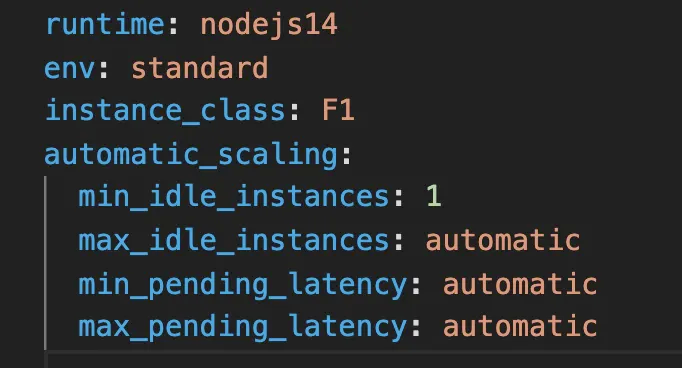

# Como hacer deploy de nuestra API a App Engine de Google Cloud Platform?

1. Crear una cuenta en Google Cloud Platform (GCP)
2. Habilitar billing (cuenta de cobro)
3. Habilitar la API de "Cloud Build"
4. Instalar el SDK de Google Cloud Platform
5. Crear el app.yaml para la configuración de App Engine

6. Desplegar (deploy) el backend a App Engine
7. `gcloud config set project YOUR-PROJECT-ID`
8. `gcloud app deploy`

## Notas

1. El puerto de escucha debe estar configurado en el archivo app.js como una variable de entorno
2. El script de "start" debe estar claro en el archivo package.json como "node ./app.js"
3. El archivo app.yaml debe estar en la raíz del proyecto